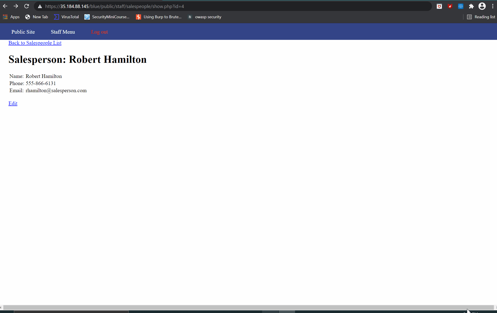
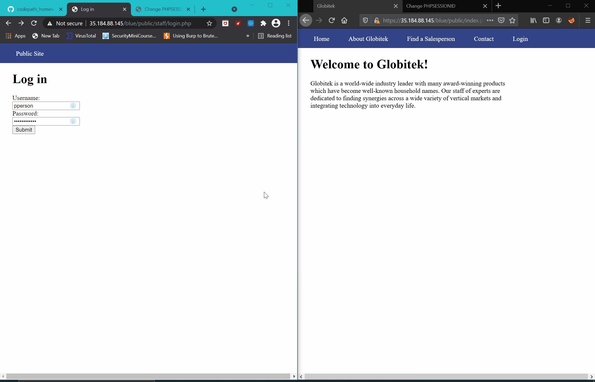
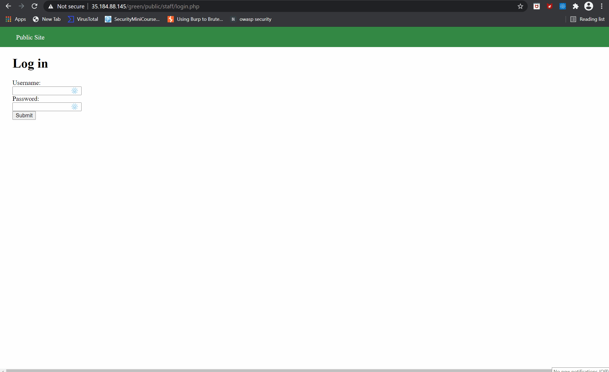

# Project 8 - Pentesting Live Targets

Time spent: 6 hours spent in total

> Objective: Identify vulnerabilities in three different versions of the Globitek website: blue, green, and red.

The six possible exploits are:

* Username Enumeration
* Insecure Direct Object Reference (IDOR)
* SQL Injection (SQLi)
* Cross-Site Scripting (XSS)
* Cross-Site Request Forgery (CSRF)
* Session Hijacking/Fixation

Each color is vulnerable to only 2 of the 6 possible exploits. First discover which color has the specific vulnerability, then write a short description of how to exploit it, and finally demonstrate it using screenshots compiled into a GIF.

## Blue

Vulnerability #1: SQL Injection

Description: When you navigate to the Salespeople tab from the main menu, you will be shown a list of all the sales staff personnel where their personal information can be shown or modified. As you will see below, a malicious user can perform a SQL Injection attack by incorporating the following code at the end of the URL (' OR SLEEP(5)=0--'). Doing so will show the information of another sales staff member. This flaw is exploited because the web developer failed to properly sanitize the URL input. 

Vulnerability #2: Session Hijacking 

Description: Since the website doesn't regenerate the Session ID, it is liable to a session hijacking attack. In order to exploit this flaw, a malicious user can log into the Globitek website from two different browsers, in this case Chrome and Firefox. They can change the session ID in one browser (Firefox) to the one generated in the other browser (Google Chrome). This allows the user to access the personal information of the staff personnel. 

## Green

Vulnerability #1: User Enumeration

Description: The web developer made the mistake of assigning two different classes for failed login attempts on the green page of the Globitek website. When I typed in 'pperson' and 'jmonroe99' into the username box along with a pseudo password, the failed login attempt message is in bold. However, when I typed in a fake username and password the failed login attempt message is unbolded. This indicates that when the failed login attempt message is in bold that the username is correct but the password isn't. A malicious user could exploit this vulnerability by enumerating through potential usernames.  

Vulnerability #2: Cross-Site Scripting

Description: The Contact Us section of the website has a security flaw that allows a user to conduct an XSS attack by injecting malicious Javascript code into the Your Name input box. In order to exploit this flaw, one would inject code such as this:  into the Your Name box, fill out the other two boxes and submit the form. If an authorized user who is logged in at the same time of the attack navigates to the Feedback tab, then they will see a continuous pop up notifcation message of the information the malicious user submitted on the Contacs Us submission form. 

## Red

Vulnerability #1: Indirect Object Reference

Description:

Vulnerability #2: Cross-Site Request Forgery

Description:

## Notes

Describe any challenges encountered while doing the work
